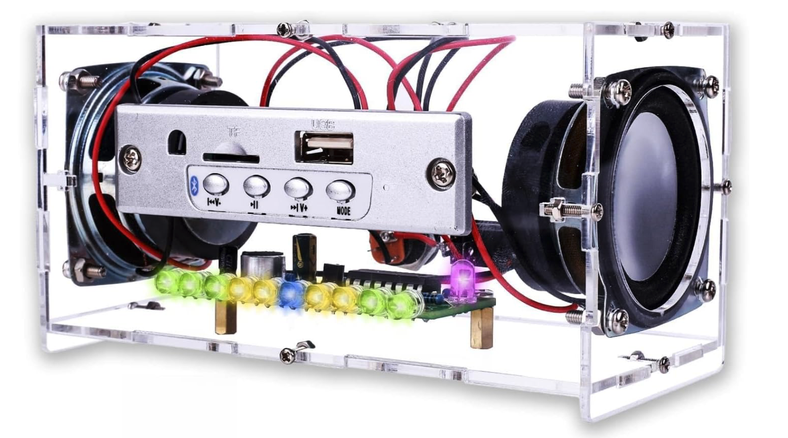
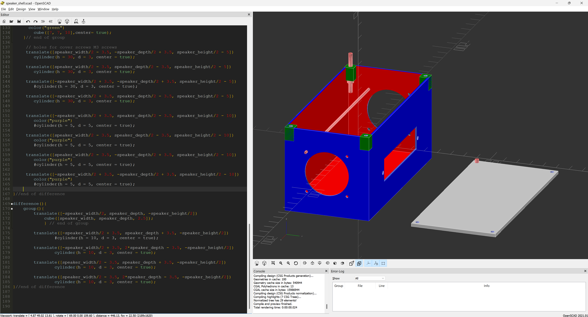
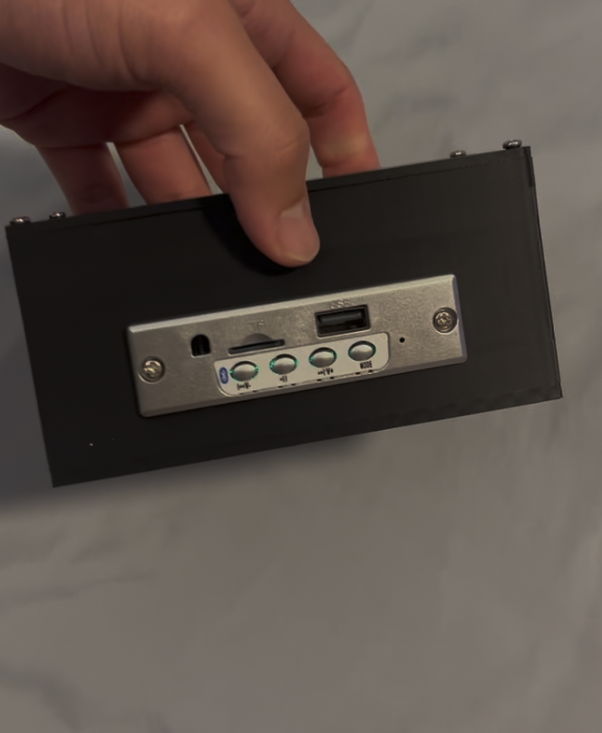
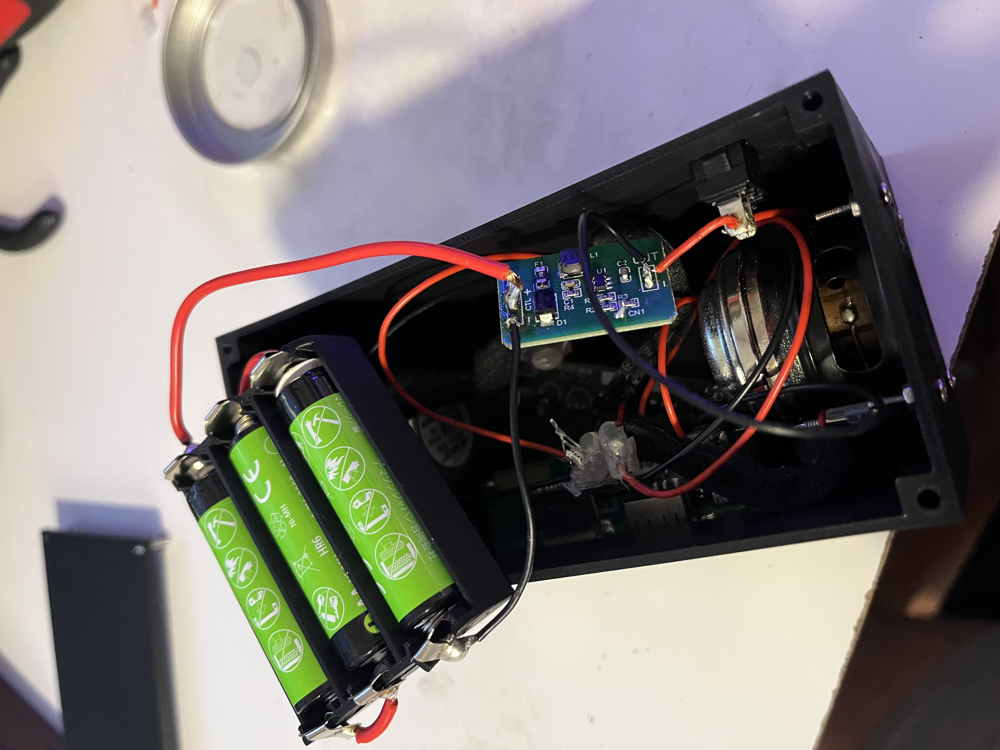
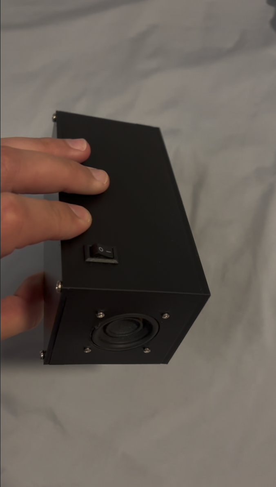

# First 3D Prints 🖨️

OpenSCAD is an open-source, script-based 3D CAD modeling environment. I chose it to apply programmatic geometry and parametric design principles to my physical engineering projects.

### Speaker Enclosure 

My first project is to redesign the enclosure for a bluetooth speaker kit from Amazon. The clear acrylic is assembled using fragile M2 captive-nut joints. 

Using OpenSCAD, I designed a sturdier, cutsom shell for the bluetooth control module and amplifier board. However, I upgraded the sound output to a pair of Bose drivers from a Soundlink Mini 2 salvaged from an e-recycling bin. The electrical impedance matches that of the original speakers but the power rating is higher. At elevated volumes, the system experiences soft clipping distortion due to the power supply current limits of the mini amplifier board under peak acoustic loads.

I coded basic algebra and geometry to make a solid shell and lid design using `difference()` and `union()` boolean operations. The result was not only thicker but also correctly fit the new speakers with bigger magnets. Negative geometry operations used to subtract material for cutouts and screw holes are highlighted in red above.

The code can be read;
* [here](https://github.com/007kev/STEP/blob/main/3D_prints/speaker_shell.scad)

Physical measurements were taken using a Chicago Brand vernier caliper with a precision of ±0.02mm to ensure tight manufacturing tolerances. The model was sliced and printed on a Bambu Lab A1 Mini using a standard 0.4mm nozzle.

For portability; I intetgrated a 3x AA NiMH battery compartment (3.6V nominal) stepped up via 5V DC-DC boost converter with a current cutting switch in the back.

