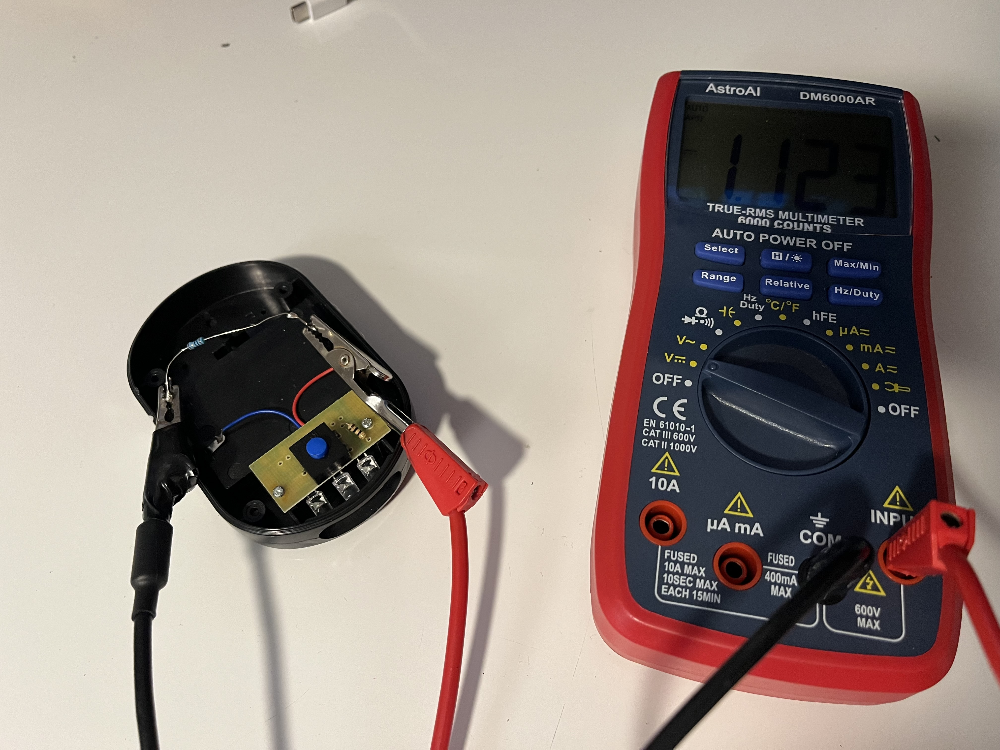
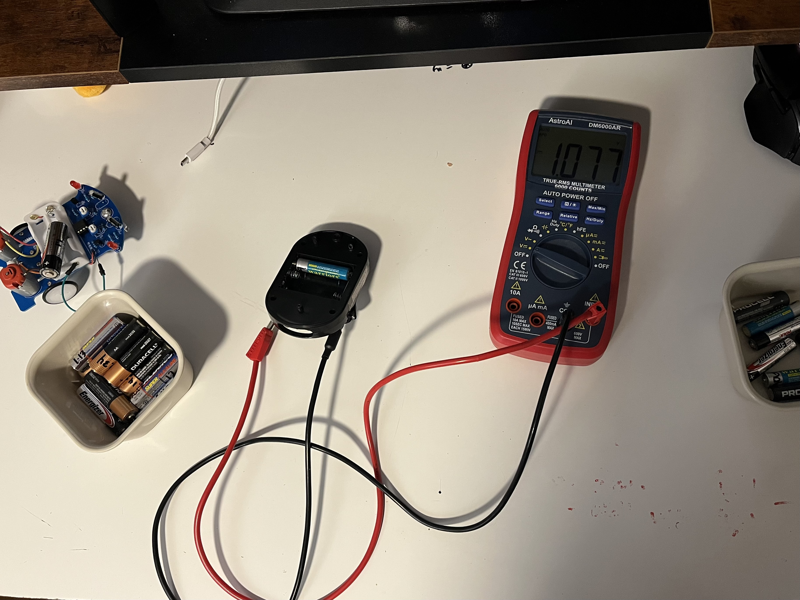

# Batteries 🔋

Here I came up with an idea to recharge AA Lithium-ion batteries using old alkaline batteries in series, however I learned along the way internal resistance and DC to DC converters

* [usable_voltage.py](https://github.com/007kev/STEP/blob/main/Batteries/usable_voltage.py)

<iframe src="./images/usable_voltage_vs_internal_resistance.pdf" width="100%" height="600px">
  This browser does not support PDFs. Please download the PDF to view it: <a href="./images/usable_voltage_vs_internal_resistance.pdf">Download PDF</a>
</iframe>

Using the loaded and unloaded voltage, plus a 10 ohm resisitor I was able to calculate which batteries were usable(above threshold) and how many in series I would need to power something small (0.1 - 0.5 amps of current draw).

