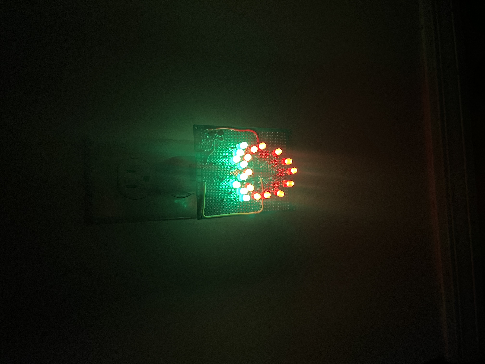

# Small Pojects 💡
These are projects I have come up with for fun.

I made this strawberry nightlight for my girlfriend. Using a multimeter, I measured the foward voltages via diode test and calculated the necessary resistors values using ohm's law.

$$
\text{Red LED: } V_{f} = 1.788\text{V} \to 160.6\,\Omega
$$

$$
\text{Green LED: } V_{f} = 2.264\text{V} \to 136.8\,\Omega
$$

The calculation assumes a 5V supply line.

The LEDs are connected in series with respective resistors; 100Ω for green LEDs and 220Ω for red LEDs.