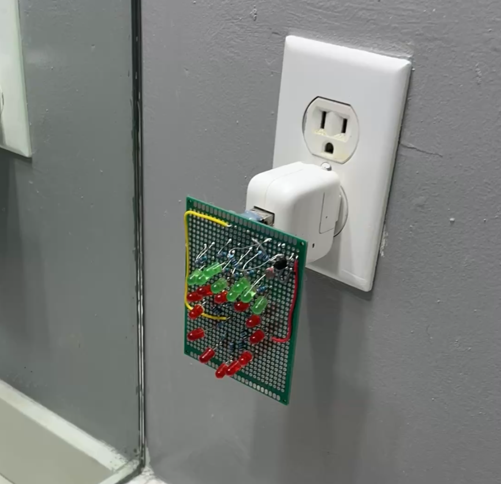
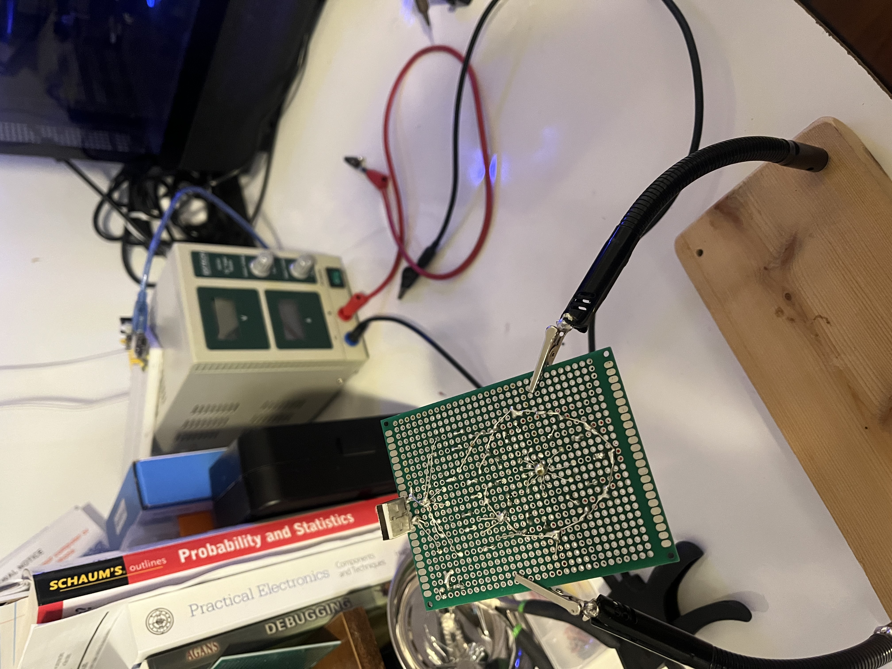

# Small Pojects 💡
These are projects I have come up with for fun.

## Strawberry Nightlight 🍓

I designed and built a nightlight for my girlfriend. Using a multimeter's diode test mode, I measured the forward voltages ($V_{f}$) and calculated the required resistors values using ohm's law.

$$
\text{Red LED: } V_{f} = 1.788\text{V} \to 160.6\Omega
$$

$$
\text{Green LED: } V_{f} = 2.264\text{V} \to 136.8\Omega
$$

The calculation assumes a 5V supply line.

Each LED is wired in series with an available current-limiting resistor (100Ω for green LEDs and 220Ω for red LEDs), with all branches then connected in parallel.

For autodarkening, I created a voltage divider using a photoresistor which has very high resistance in the dark and a simple NPN transistor. To set the transistor's base bias, I placed two 100 kΩ resistors in parallel to achieve an equivalent base resistance of 50 kΩ. This project could improve with a 100kΩ range potentiometer to allow manual tuning of light sensitivity threshold.