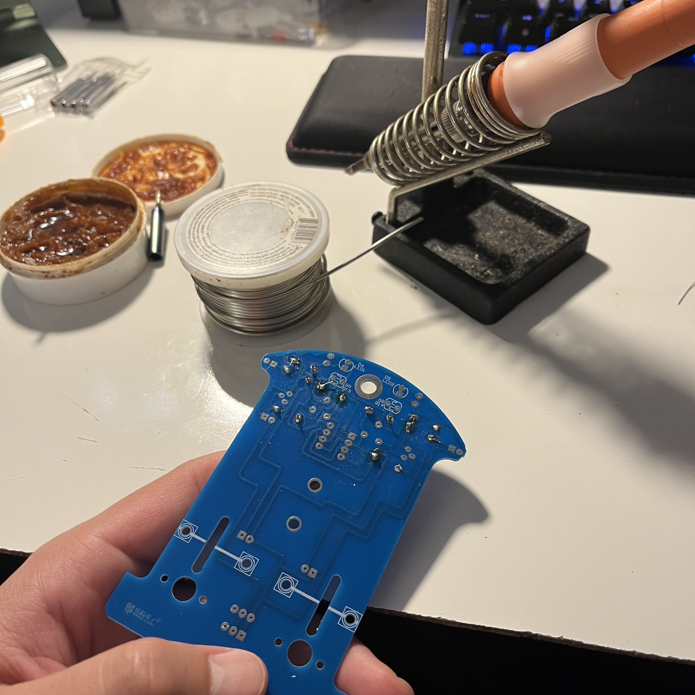
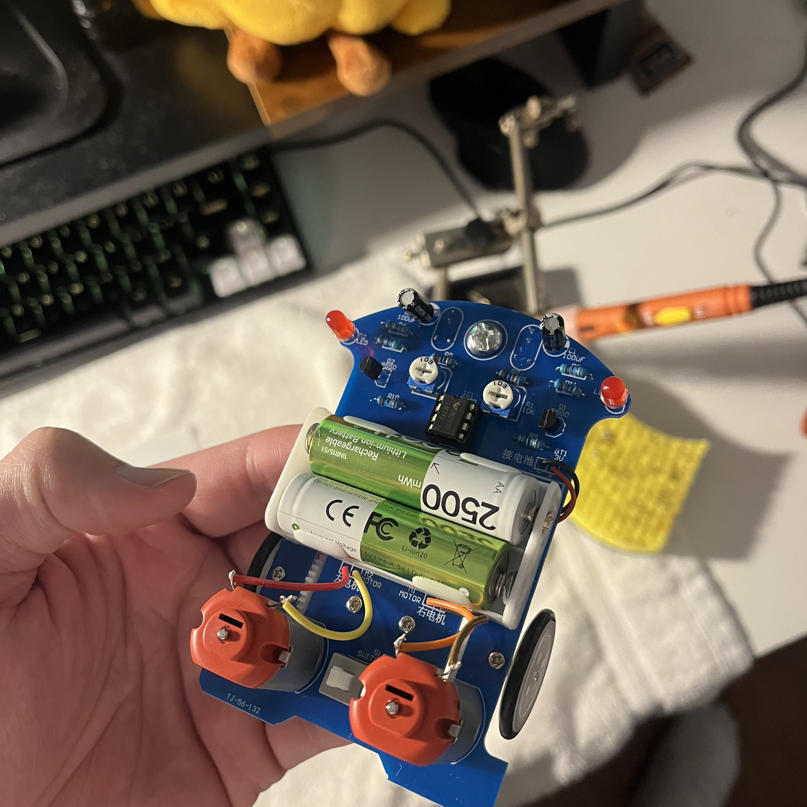
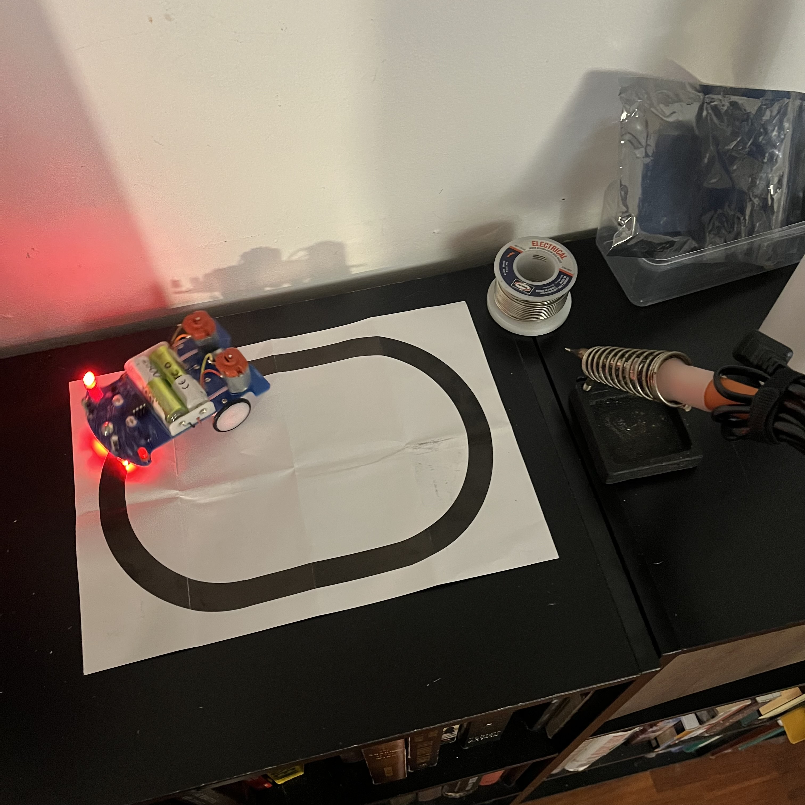
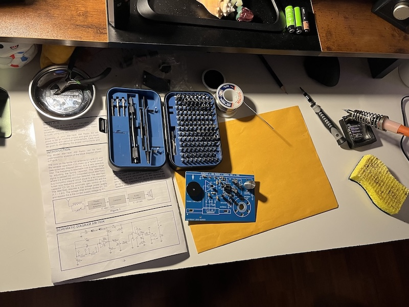
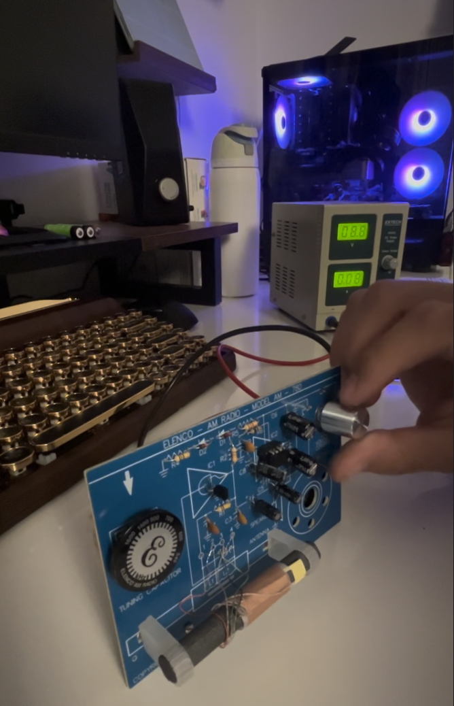

# Soldering 👨🏻‍🏭

Since I enjoy working with my hands, soldering came easy to me. However, I am still learning to perfect my skills by practicing. I started by working on these kits from Amazon.

## Line Following Robot 🤖

The PCB was already created and instructions included. I learned to solder each component according to instructions and tested the robot on a custom track. I breifly documented the steps.

## AM Radio 📻

This AM Radio kit is from Amazon. Componenets were assembled and soldered according to instruction manual.

## Bluetooth Speaker 🔊

LOADING...